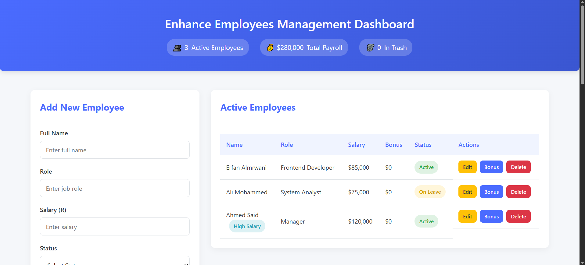

# Employee Management System

 

CRUD application for managing employees with features like:
- Add/edit/delete employees
- Bonus calculation
- Salary filtering
- Trash management

## Technologies Used
- HTML5
- CSS3
- JavaScript (Vanilla JS)

## How to Run
Simply open `index.html` in any modern browser